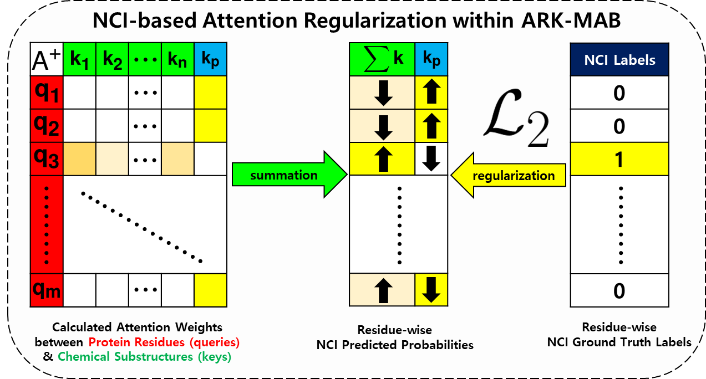

# ArkDTA: Attention Regularization guided by non-Covalent Interactions for Explainable Drug-Target Binding Affinity Prediction

## Abstract

Protein-ligand binding affinity prediction is a central task in drug design and development. Cross-modal attention mechanism has recently become a core component of many deep learning models due to its potential to improve model explainability. Non-covalent interactions, one of the most critical domain knowledge in binding affinity prediction task, should be incorporated in protein-ligand attention mechanism for more explainable deep DTI models. We propose ArkDTA, a novel deep neural architecture for explainable binding affinity prediction guided by non-covalent interactions. Experimental results show that ArkDTA achieves predictive performance comparable to current state-of-the-art models while significantly improving model explainability. Qualitative investigation into our novel attention mechanism reveals that ArkDTA can identify potential regions for non-covalent interactions between candidate drug compounds and target proteins, as well as guiding internal operations of the model in a more interpretable and domain-aware manner. (*submitted to ISMB2023, under review*)

## Overview of ArkDTA


## Attention Regularization guided by non-Covalent Interactions



## Prerequisites for running ArkDTA

- Python 3.7.9
- CUDA: 11.X
- Download and extract data.tar.gz ([link](https://drive.google.com/file/d/1hmR5w47VUk6RW0br8BanJT94R2FPHgDL/view?usp=share_link)), 45MB) at current directory. These files are the preprocessed datasets PDBBind (ver.2020), Davis and Metz.
- Download and extract saved.tar.gz ([link](https://drive.google.com/file/d/1iVttdzlAMXYeJ11JKVe19Dkvgpb8PZSS/view?usp=share_link)), 170MB) at directory **./saved**. These files are the model checkpoints for each fold of the PDBbind datset.

## Installing the Python (3.8.12) Conda Environment

```
conda env create -f arkdta.yaml
conda activate arkdta
```

## How to use the ArkDTA source code

### Training ArkDTA on PDBBind Dataset

Run the following code,
```
python run.py -pn {wandb_project_name} -sn arkdta -mg {multiple gpu indices}
```

If you want to train ArkDTA on the IC50 subset, configure the **/sessions/arkdta.yaml** by editing the following,
```
ba_measure: IC50 
```

### Evaluating ArkDTA on PDBBind Dataset (5CV)

Run the following code,
```
python run.py -pn {wandb_project_name} -sn arkdta -mg {multiple gpu indices} -tm
```

### Finetuning ArkDTA on other datasets (Davis, Metz)

Configure the **/sessions/arkdta.yaml** by editing the following,
```
dataset_subsets: davis
dataset_partition: randomsingle
```

Then run the following code,
```
python run.py -pn {wandb_project_name} -sn arkdta -mg {multiple gpu indices} -ft {davis or metz}
```

### Evaluating ArkDTA on other datasets
Run the following code,
```
python run.py -pn {wandb_project_name} -sn arkdta -mg {multiple gpu indices} -tm -cn {your/saved/path_davis or _metz}
```

### Running model inference and extracting attention maps from ArkDTA

Run the following script,
```
./arkdta.sh
```

You can change the input SMILES (ligands) or FASTA sequence (proteins) by editting the **arkdta.sh** file.

#### 4x6n, 3Y5


#### 6n77, KEJ


#### 8bq4, QZR


## Contributors

<table>
	<tr>
		<th>Name</th>		
		<th>Affiliation</th>
		<th>Email</th>
	</tr>
	<tr>
		<td>Mogan Gim</td>		
		<td>Data Mining and Information Systems Lab,<br>Korea University, Seoul, South Korea</td>
		<td>akim@korea.ac.kr</td>
	</tr>
	<tr>
		<td>Junseok Choe</td>		
		<td>Data Mining and Information Systems Lab,<br>Korea University, Seoul, South Korea</td>
		<td>juns94@korea.ac.kr</td>
	</tr>
	<tr>
		<td>Seungheun Baek</td>		
		<td>Data Mining and Information Systems Lab,<br>Korea University, Seoul, South Korea</td>
		<td>tmdgms9417@korea.ac.kr</td>
	</tr>
	<tr>
		<td>Jueon Park</td>		
		<td>Data Mining and Information Systems Lab,<br>Korea University, Seoul, South Korea</td>
		<td>jueon_park@korea.ac.kr</td>
	</tr>
	<tr>
		<td>Chaeeun Lee</td>		
		<td>Data Mining and Information Systems Lab,<br>Korea University, Seoul, South Korea</td>
		<td>chaeeunlee1997@korea.ac.kr</td>
	</tr>
	<tr>
		<td>Minjae Ju&dagger;</td>		
		<td>LG CNS, AI Research Center, Seoul, South Korea</td>
		<td>minjae.ju@lgcns.com</td>
	</tr>
	<tr>
		<td>Sumin Lee&dagger;</td>		
		<td>LG AI Research, Seoul South Korea</td>
		<td>sumin.lee@lgresearch.ai</td>
	</tr>
	<tr>
		<td>Jaewoo Kang*</td>		
		<td>Data Mining and Information Systems Lab,<br>Korea University, Seoul, South Korea</td>
		<td>kangj@korea.ac.kr</td>
	</tr>

</table>


- &dagger;: *This work was done while the author was a graduate student at Korea University Computer Science Department.*
- &ast;: *Corresponding Author*